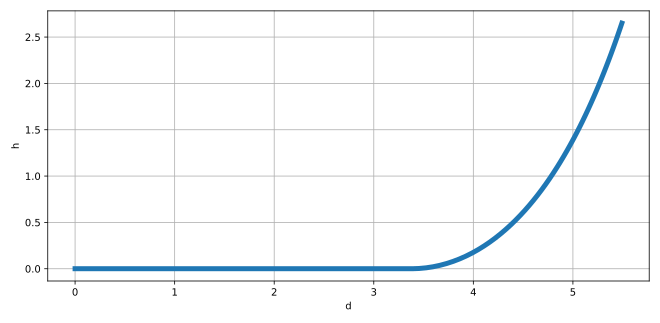

# pycatenary

[](https://app.travis-ci.com/tridelat/pycatenary)


## Features

This python package solves catenary equations for cables at static equilibrium.

- Elasticity taken into account
- Contact with floor/seabed taken into account
- Handles partly or fully lifted lines
- Multisegmented cables possible

## Installation

Through pip:

```
pip install pycatenary
```

or by running the following command in the root folder of the pycatenary project

```
python setup.py install --user
```

## Getting Started

To create a cable:

```python
from pycatenary import cable

# define properties of cable
length = 6.98  # length of line
w = 1.036  # submerged weight
EA = 560e3  # axial stiffness
floor = True  # if True, contact is possible at the level of the anchor
anchor = [0., 0., 0.]
fairlead = [5.2, 1., 2.65]

# create cable instance
l1 = cable.MooringLine(L=length,
                       w=w,
                       EA=EA,
                       anchor=anchor,
                       fairlead=fairlead,
                       floor=floor)

# compute calculations
l1.computeSolution()
```

Position of fairlead and anchor can be changed as follows:

```python
# change fairlead position
l1.setFairleadCoords([5.4, 1., 2.65])

# recompute solution
l1.computeSolution()
```

Other useful functions:

```python
# get tension along line (between 0. and total line length)
s = 5.
T = l1.getTension(s)

# get xyz coordinates along line
xyz = l1.s2xyz(s)

```

For extra functionality, please refer to the documentation: https://tridelat.github.io/pycatenary

## Plotting

With matplotlib installed, the cable can be plotted in 2D:

```python
# plot cable cable.MooringLine instance l1
l1.plot2D()
```



Or in 3D:

```python
# plot cable cable.MooringLine instance l1
l1.plot3D()
```


