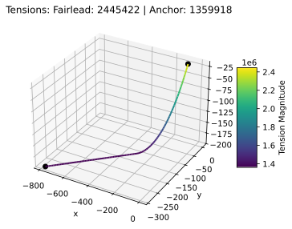
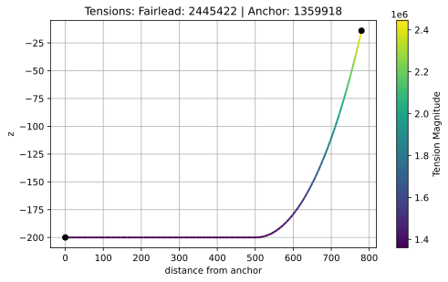

# pyCatenary

[](https://app.travis-ci.com/tridelat/pycatenary)


A Python library for solving catenary equations.

## About pyCatenary

### Features

- Solves catenary equations for elastic or fully rigid cables.
- Contact with flat floor/seabed for partly lifted lines.
- Multisegmented cables with different properties.
- Solution for catenary lines in both 2D or 3D coordinate systems.
- Tension and position retrievable along line (2D/3D).

### Assumptions

- All lines, included multisegmented ones, have a single pure catenary shape.
- Gravitational acceleration is along -Z in 3D, -Y in 2D.
- If floor/seabed is enabled, it is assumed flat.
- For multisegmented lines, elongation is calculated per section (so the order matter) and once the solution for the elongated catenary is found, tension along the line is retrieved directly from the catenary equation. This means that tensions at the fairlead and anchor are as intended, and tension along the line are calculated from the catenary shape using averaged submerged weight over the lifted line length.

## Installation

### PyPI version

For installing the latest official release on the Python Package Index (PyPI):

```bash
pip install pycatenary
```

### Development version

For installing a development version through pip:

```bash
git clone https://github.com/tridelat/pycatenary
cd pycatenary
pip install -e .
```

## Getting Started

To create a cable:

```python
from pycatenary import MooringLine

# define properties of cable
line1 = MooringLine(
    fairlead=[-54.50, -19.84, -14.0],  # fairlead position [m]
    anchor=[-787.09, -286.48, -200],  # anchor position [m]
    L=850.0,  # unstretched line length [m]
    w=5844.1,  # submerged weight [N/m]
    EA=3.27e9,  # axial stiffness [N]
    floor=True,  # if True, floor at anchor level
)

# compute solution for the catenary
line1.compute_solution()
```

Some useful of functions for retrieving tensions and positions of mooring line:

```python
# get tension at the fairlead
line1.get_tension_fairlead()

# get tension at the anchor
line1.get_tension_anchor()

# get tension at 800m along the line from the anchor
line1.get_tension(800.0)
# get position at 800m along the line from the anchor
line1.get_position(800.0)

# get tension at 5m along the line from fairlead
line1.get_tension(5.0, from_fairlead=True)
# get position at 5m along the line from fairlead
line1.get_position(5.0, from_fairlead=True)
```

Position of fairlead and anchor can be changed as follows (do not forget to recompute solution after update positions):

```python
# change fairlead position
line1.set_fairlead_position([30.0, -50.23, -14.0])

# recompute solution
line1.compute_solution()
```

For extra functionality, please refer to the documentation: https://tridelat.github.io/pycatenary

## Plotting

With matplotlib installed, the cable can be plotted in 3D:

```python
line1.plot()
```


Or in 2D:

```python
line1.plot_2d()
```

